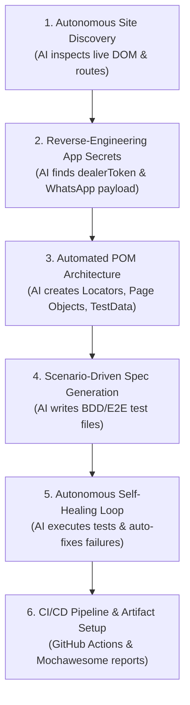

# Zero-Code AI-Driven Cypress Automation Guide

This guide explains the exact **AI-driven and MCP (Model Context Protocol)** methodology used to architect and construct this entire Cypress JavaScript framework from scratch.

Use this guide for YouTube tutorials, team presentations, or learning modern AI test engineering workflows.

---

## 🤖 What is MCP (Model Context Protocol)?

**Model Context Protocol (MCP)** is an open standard that allows AI models (like Gemini, Claude, or local LLMs) to connect directly to external tools, databases, live browsers, and developer environments.

In test automation, browser automation MCP allows an AI agent to:
1. Open a real browser instance.
2. Navigate to target URLs (`https://ziarakart.vercel.app/`).
3. Query the accessibility tree, inspect DOM elements, and extract live locators.
4. Execute user flows (click, type, scroll) in real-time.
5. Inspect application bundles, network calls, and localStorage keys.

---

## 🗺️ The 6-Step Autonomous AI Workflow

---

### Step 1: Autonomous Web Discovery
- Instead of asking a human to inspect HTML in Chrome DevTools, the AI inspected `https://ziarakart.vercel.app/`.
- Extracted all headings, navigation links, buttons, form inputs, and interactive components.
- Identified that ZiaraKart is a React single-page app (SPA) with routes: `/`, `/about`, `/products`, `/distributor`, `/checkout`.

### Step 2: Reverse-Engineering Business Rules
1. **Wholesale Access Control**:
   - Guests see blurred prices with a **"Request Access"** button.
   - Retailers are authenticated via `localStorage.getItem("dealerToken")`.
   - When `dealerToken` is present, prices unblur and the **"Add"** buttons activate with quantity controls (`+` and `−`).
2. **WhatsApp Order Integration**:
   - The application does not use traditional credit card payment gateways.
   - When an order is placed on `/checkout`, the app compiles an encoded WhatsApp URL:
     `https://wa.me/917979720438?text=*🔥 New ZiaraKart Wholesale Order!...`
   - It triggers `window.open(url, "_blank")` and displays a confirmation view.

### Step 3: Generating Page Object Models (POM)
- **Locators**: Separated into `cypress/support/locators/` (`header`, `products`, `cart`, `checkout`, `dealer-modal`).
- **Pages**: Built classes with methods:
  - `BasePage.js`: Dynamic loading synchronization and dealer auth mocking.
  - `HomePage.js`: Search, category selection, card actions.
  - `CartDrawer.js`: Slide-over transition handling (`translate-x-0` vs `translate-x-full`).
  - `CheckoutPage.js`: Intercepting `window.open` via Cypress stubs to capture the WhatsApp payload.
  - `DealerModal.js`: Form filling and validation assertions.

### Step 4: Writing Declarative Test Suites
- 15 comprehensive test cases covering:
  - Header branding & multi-page navigation.
  - Live product search & category filtering.
  - Unauthenticated guest mode & modal validations.
  - Full end-to-end dealer purchase journey with WhatsApp link validation.
  - Cart drawer edge cases (empty states, decrementing to zero).

### Step 5: The Autonomous Self-Healing Loop
When running tests, the AI catches and fixes runtime variations:
- Category selection via select dropdowns.
- React catalog hydration and asynchronous loading using dynamic waiting.
- Modal transitions and form validation messages.
- WhatsApp URL encoding and parameter interception.

### Step 6: CI/CD Pipeline & Mochawesome Reports
- Configured Mochawesome HTML report generator.
- Built `.github/workflows/cypress.yml` for GitHub Actions push/PR automation.

---

## 🎥 YouTube Tutorial Talking Points

When demonstrating this workflow on your channel:
1. **Show the Problem**: Traditional automation requires hours of manual DevTools inspection, copying fragile XPaths, and debugging timing issues.
2. **Show the Prompt**: Ask the AI: *"Analyze https://ziarakart.vercel.app/, discover all user journeys, and build a full Cypress JS POM framework."*
3. **Show the Live Analysis**: Show how the AI extracted hidden state (`dealerToken`, WhatsApp order URL) by inspecting the application bundle.
4. **Show Self-Healing**: Run the tests, show where the AI caught a flaky locator or timing issue, and show how the AI fixed it automatically.
5. **Show the Green Suite**: Run `npm test` or `npm run test:headed` to show all 15 tests passing smoothly.
